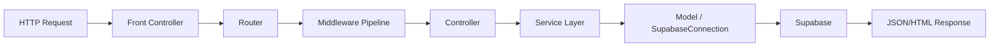

# HRIS MVP System Assessment and Improvement Roadmap

## 1. Assessment Scope
This assessment covers architecture, end-to-end workflow behavior, user experience, performance, security posture, scalability readiness, and feature completeness.

## 2. Executive Summary
- The system has a clear MVC structure, broad module coverage, and role-based workflows.
- Core attendance and leave flows are functional and integrated with Supabase.
- The most important opportunities are in security hardening, performance optimization, and consistency of server-side access enforcement.

## 3. Current Architecture Snapshot

Strengths:
- Clean layering (controller-service-model).
- Middleware support for auth, role, logging, and headers.
- Backward compatibility through legacy routes.

Constraints:
- Mixed client-side and server-side access checks on some web views.
- File-based rate limiting not ideal for distributed deployment.
- Some report operations perform expensive in-memory filtering/enrichment.

## 4. Detailed Findings

## 4.1 Performance Bottlenecks
- Report generation performs additional per-record lookups and PHP-side filtering, which can become slow as data grows.
- Multiple dashboard widgets trigger parallel API calls and can produce redundant data fetches.
- Extensive debug logging can add overhead in production.

## 4.2 Usability Issues
- Access control behavior can appear inconsistent because some web pages rely on frontend checks after render.
- In-module status synchronization may require manual refresh under some conditions.
- Error handling is generally present, but user-facing recovery guidance can be improved.

## 4.3 Security Vulnerabilities
- Authentication token stored in localStorage increases risk under XSS compromise scenarios.
- CSP currently allows `unsafe-inline`, reducing CSP effectiveness.
- Production deployments could unintentionally expose debug details if logging/display settings are not hardened.

## 4.4 Scalability Limitations
- Rate-limit storage uses local JSON file, unsuitable for multi-instance horizontal scaling.
- Legacy and modern route duplication increases maintenance burden.
- Some filtering is handled application-side rather than pushed down to efficient DB-side query plans.

## 4.5 Feature Gaps
- Leave approval side effects and attendance coupling should be fully standardized and explicitly validated for all edge cases.
- Operational monitoring dashboards and alerting are not formalized in the current codebase.
- No consolidated in-app help/onboarding for first-time users.

## 5. Prioritized Recommendations

## 5.1 Priority Matrix

| ID | Recommendation | Priority | Impact | Effort |
|---|---|---|---|---|
| R1 | Enforce server-side auth/role checks for sensitive web routes | P1 | High | Medium |
| R2 | Migrate auth token handling to secure httpOnly cookie strategy | P1 | High | High |
| R3 | Remove/guard debug logs and harden production error policies | P1 | High | Low |
| R4 | Refactor reporting to DB-level aggregation/views/RPC | P2 | High | Medium-High |
| R5 | Replace file-based rate limiting with centralized store (Redis/Supabase) | P2 | Medium-High | Medium |
| R6 | Normalize leave-approval attendance side effects with idempotent pattern | P2 | Medium | Medium |
| R7 | Consolidate duplicate legacy routes with compatibility abstraction | P3 | Medium | Medium |
| R8 | Add user onboarding/help center and improved error-recovery UX | P3 | Medium | Low-Medium |

## 5.2 Actionable Implementation Plan

### R1: Server-Side Access Enforcement
- Apply `auth` and `role:admin` middleware consistently to privileged web routes.
- Add route-level test cases for unauthorized page access.
- Success metric: direct URL access by non-admin returns proper redirect/error response.

### R2: Secure Session Model
- Transition from localStorage JWT persistence to secure cookie-based session transport.
- Add CSRF validation for state-changing endpoints.
- Success metric: no JWT accessible via browser storage APIs.

### R3: Production Hardening
- Introduce environment-based log levels.
- Disable verbose debug output outside development.
- Ensure generic user-facing error payloads in production.
- Success metric: no sensitive stack/internal details in production responses.

### R4: Report Performance Refactor
- Push date/status/department aggregation into database views or RPC.
- Reduce N+1 enrichment by batched joins/data maps.
- Success metric: report API latency reduction and stable response times under larger datasets.

### R5: Scalable Rate Limiting
- Replace JSON file storage with Redis or equivalent centralized throttle store.
- Keep existing response headers contract.
- Success metric: consistent throttling behavior across multiple app instances.

### R6: Leave-Attendance Consistency
- Standardize approved-leave attendance record creation with idempotency checks.
- Add integration tests for approval, overlap, and rollback-safe behavior.
- Success metric: deterministic attendance status during approved leave ranges.

### R7: Route Consolidation
- Keep legacy compatibility but route through a unified mapping layer.
- Reduce duplicate endpoint logic and maintenance effort.
- Success metric: fewer route definitions with unchanged client compatibility.

### R8: UX Enhancements
- Add inline contextual guidance for common actions and failures.
- Add proactive empty-state assistance and recovery actions.
- Success metric: reduced support tickets for common user tasks.

## 6. Suggested Delivery Phases

### Phase 1 (Immediate Stabilization)
- R1, R2 (design start), R3

### Phase 2 (Scale and Consistency)
- R4, R5, R6

### Phase 3 (Maintainability and UX)
- R7, R8

## 7. Resource Requirement Estimates

| Area | Primary Roles Needed | Notes |
|---|---|---|
| Security hardening | Backend engineer, security reviewer | Includes auth/session migration decisions |
| Reporting optimization | Backend engineer, database engineer | Requires query/view design and validation |
| Scalability upgrades | Backend engineer, DevOps | Centralized rate-limiter deployment/config |
| UX improvements | Frontend engineer, product/QA | Requires user-flow testing and copy updates |

## 8. KPI Tracking Recommendations
- Authentication/session incident rate
- 95th percentile API latency for report endpoints
- Rate-limit false-positive/false-negative incidents
- Leave workflow consistency defects
- User task completion success rate without support intervention

## 9. Conclusion
The platform is functionally strong and already production-oriented in structure. The highest-value path is to harden access/session security, optimize data-heavy reporting paths, and improve distributed scalability safeguards. Completing the prioritized roadmap will materially improve reliability, security, and user confidence.

