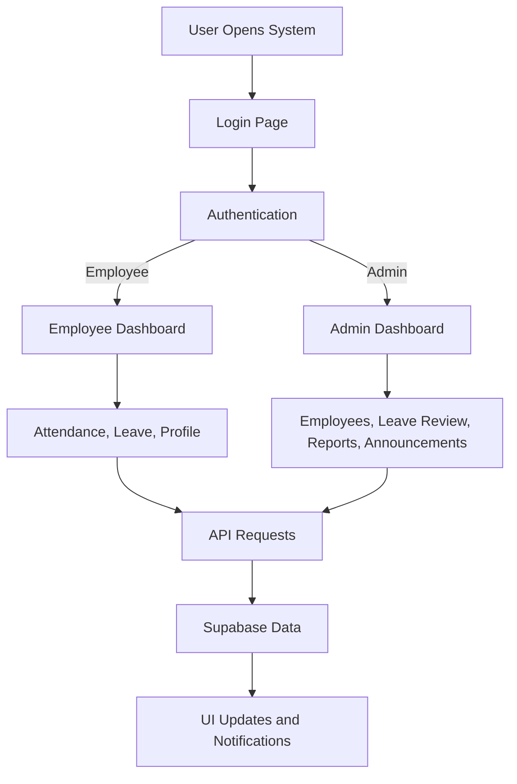
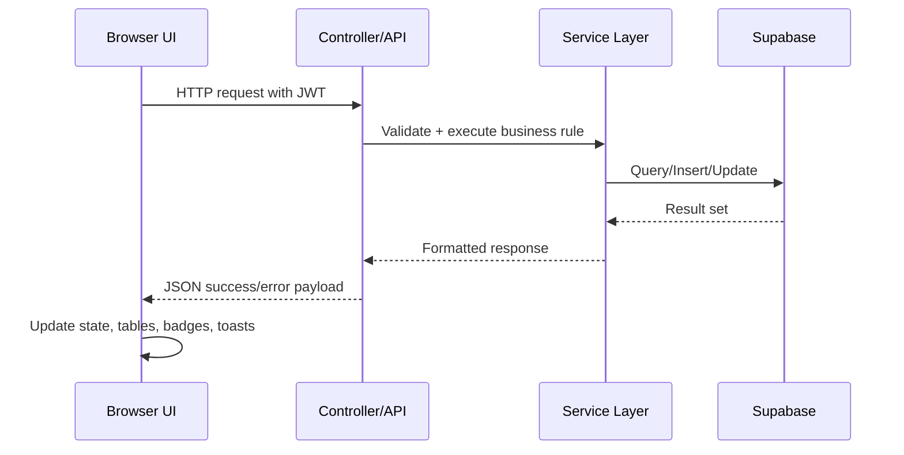

# HRIS MVP User Manual

## 1. Purpose and Audience
This manual is for employees, administrators, and support staff using HRIS MVP for attendance, leave, employee records, announcements, and reporting.

## 2. System Overview
HRIS MVP is a web-based Human Resource Information System with role-based access.

- Employees use it for attendance, leave requests, and profile access.
- Administrators use it for employee management, leave approvals, announcements, and analytics.
- The system uses JWT authentication and Supabase-backed data services.

### 2.1 High-Level Workflow

## 3. User Roles and Permissions

| Feature | Employee | Admin |
|---|---:|---:|
| Login / Logout | Yes | Yes |
| View Employee Dashboard | Yes | Yes |
| View Admin Dashboard Metrics | No | Yes |
| Time In / Time Out | Yes | Yes |
| View Own Attendance History | Yes | Yes |
| Submit Leave Request | Yes | Yes |
| Approve / Deny Leave Requests | No | Yes |
| View Employee Directory | No | Yes |
| Create / Update / Deactivate Employees | No | Yes |
| Generate Reports | No | Yes |
| Manage Announcements | No | Yes |

## 4. Getting Started

### 4.1 Login
1. Open the system URL.
2. Enter your email and password.
3. Click **Sign In**.
4. If prompted to change password, complete the password change flow first.

### 4.2 Logout
1. Click **Logout** from the sidebar.
2. Confirm logout in the modal.

## 5. Navigation Guide

### 5.1 Common Navigation
- **Dashboard**: Main overview and quick actions.
- **My Attendance / Attendance**: Attendance actions and history.
- **Leave Requests**: File and track leave requests.
- **My Profile**: View/update profile data (as available).

### 5.2 Admin-Only Navigation
- **Employees**: Employee list and management.
- **Reports**: Attendance, leave, employee, and productivity analytics.

## 6. Feature Instructions

## 6.1 Attendance Workflow

### Time In
1. Go to **Dashboard** or **My Attendance**.
2. Click **Time In**.
3. Confirm action in modal if prompted.
4. Wait for success notification.
5. Verify:
   - Status badge changes to timed-in state.
   - Time In button becomes disabled/greyed.
   - Time Out button becomes enabled.

### Time Out
1. Click **Time Out** after shift.
2. Confirm action.
3. Verify:
   - Success notification appears.
   - Status updates to completed.
   - Work hours appear.
   - Both attendance buttons are disabled.

### Attendance History
1. Open **My Attendance**.
2. Review recent records table.
3. Confirm today’s time in/out and status.

## 6.2 Leave Workflow

### Submit Leave Request (Employee)
1. Go to **Leave Requests**.
2. Click **Request Leave**.
3. Select leave type.
4. Set start and end dates.
5. Enter reason.
6. Review calculated working days.
7. Submit request.

### Review Leave Request (Admin)
1. Open **Leave Requests**.
2. In **Pending Requests**, select a request.
3. Review details.
4. Click **Approve** or **Deny**.
5. If denying, provide reason when prompted.
6. Confirm request moves to approved/denied sections.

## 6.3 Employee Management (Admin)
1. Open **Employees**.
2. Search or filter records.
3. Create a new employee or open an existing record.
4. Update fields and save changes.
5. Deactivate employee if required.

## 6.4 Reports (Admin)
1. Open **Reports**.
2. Choose report type:
   - Attendance
   - Leave
   - Employees
   - Productivity
3. Apply date range and filters.
4. Review summary cards, charts, and table results.

## 6.5 Announcements (Admin)
1. Access announcements management.
2. Create new announcement with title/content.
3. Update or deactivate existing announcements.
4. Validate employee visibility for active announcements.

## 7. Data Flow and Integration Points

### 7.1 Data Flow

### 7.2 Integration Points
- Supabase Auth for token validation and refresh.
- Supabase tables for attendance, leave, employee, and report data.
- Frontend chart integration for report visualizations.
- Middleware integration for authentication, role checks, logging, and security headers.

## 8. Troubleshooting Guide

### 8.1 Login Issues
- Verify email/password format.
- Confirm account is active.
- Clear browser cache and local storage, then retry.
- If token-related errors persist, logout/login again.

### 8.2 Attendance Issues
- If Time Out fails, refresh and confirm timed-in status first.
- Ensure date/time on device is correct.
- Re-open My Attendance to confirm latest state.
- If still failing, capture API error message and contact support.

### 8.3 Leave Issues
- Ensure all required fields are completed.
- Verify date range includes working days.
- Check for overlapping leave requests.
- Confirm selected leave type is valid.

### 8.4 Report Issues
- Verify date range and filters are not too restrictive.
- Retry with broader date range.
- Check role permissions (reports are admin-only).

### 8.5 Access Denied (403)
- Confirm user role has access to the module.
- Logout/login to refresh session.

## 9. Error Message Quick Reference
- **401 Unauthorized**: Missing/invalid token.
- **403 Forbidden**: Role does not have permission.
- **404 Not Found**: Endpoint/resource missing.
- **422 Validation Error**: Input data failed business rule checks.
- **429 Too Many Requests**: Rate limit reached.
- **500 Internal Server Error**: Unexpected backend failure.

## 10. Frequently Asked Questions

### Q1: Why can I not access Reports?
Reports are restricted to admin users.

### Q2: Why am I forced to change password?
New employee accounts may require first-login password reset for security.

### Q3: Why can’t I submit Time In twice?
Duplicate time-in for the same workday is blocked by validation.

### Q4: Why was my leave request rejected?
Common causes: date overlap, invalid leave type, insufficient policy compliance, or admin decision.

### Q5: Why do I see stale data between pages?
Refresh the page and re-open module tabs to force latest API synchronization.

## 11. Best Practices
- Logout on shared/public devices.
- Avoid opening many tabs when performing updates.
- Validate dates and request details before submission.
- Capture exact error text when reporting incidents.

## 12. Support Escalation Checklist
Before escalating, collect:
- User role and email
- Module name
- Exact action performed
- Timestamp
- Screenshot/error message
- Browser and device details

